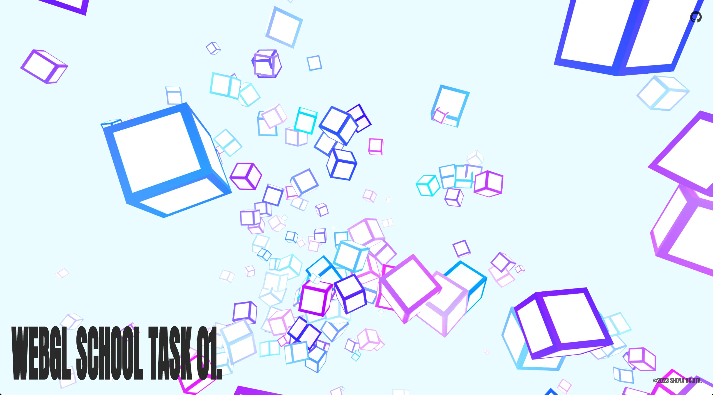

# Task.01 ~ WebGL スクール第 10 期

## 🪬 ~ 要件

- `Box Geometry` を利用すること
- ボックスが画面上に１００個以上描かれるようにすること
- 配置は自由
- 色や大きさなどは自由

## 👾 ~ Demo

- https://dev.shoya-kajita.com/015/



## 🎮 ~ Getting Started

- node : v.17.0.0
- npm : 8.1.0

```
// install
npm i

// development
npm run dev

// production
npm run build

// build preview
npm run preview
```

## 🗒️ ~ Note

### GPUComputationRenderer について

- [Three.js の GPGPU のサンプルが難しすぎるから解体して勉強してみる](https://qiita.com/Murasaqi/items/20accc9b5fb9845fc73a)
- [GPGPU がまったくわからないので GPUComputationRenderer.js をまず調べてみるメモ](https://nogson2.hatenablog.com/entry/2018/04/07/130727)
- [【React Three Fiber】GPGPU を使用した Particles の実装 @ふぉくるさん](https://qiita.com/nemutas/items/b40baa2a1f33fae6b20d)
- [Toon Shading @中野みさきさん](https://github.com/mnmxmx/toon-shading)

### curlNoise について

- [glsl-curl-noise](https://github.com/cabbibo/glsl-curl-noise/blob/master/curl.glsl)

### クォータニオンについて

- [クォータニオン](https://qiita.com/aa_debdeb/items/c34a3088b2d8d3731813)

### インスタンスメッシュについて

- [インスタンスメッシュの個別回転 @ふぉくるさん](https://qiita.com/nemutas/items/5b72de3ab7870cf2f414)

### 三角関数について

- [WebGL 開発に役立つ重要な三角関数の数式・概念まとめ（Three.js 編）](https://ics.media/entry/10657/)

### Fog について

- [距離フォグ：wgld.org](https://wgld.org/d/webgl/w060.html)
